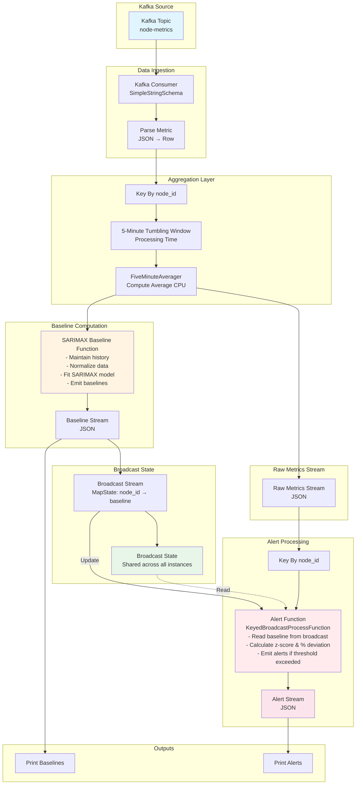

# Flink SARIMAX Baseline & Alert Stream Architecture

## Stream Flow Description

### 1. **Data Ingestion**

- Kafka topic `node-metrics` contains JSON messages with `node_id`, `cpu_utilization`, and `timestamp`
- Kafka consumer reads messages using `SimpleStringSchema`
- Parser converts JSON strings to Flink `Row` objects

### 2. **Aggregation Layer**

- Stream is keyed by `node_id` to ensure per-node processing
- 5-minute tumbling windows aggregate raw samples
- `FiveMinuteAverager` computes average CPU utilization per window

### 3. **Stream Split**

The aggregated stream splits into two branches:

#### **Baseline Branch:**

- `SARIMAX Baseline Function` processes 5-minute aggregates:
  - Maintains rolling history (scaled and raw)
  - Tracks running mean/std using Welford's algorithm
  - Normalizes incoming data
  - Fits SARIMAX model periodically (every N samples)
  - Emits baseline forecasts as JSON

#### **Raw Metrics Branch:**

- Converts aggregated rows to JSON strings
- Preserves original CPU values for comparison

### 4. **Broadcast State Pattern**

- Baseline stream is broadcast using `MapStateDescriptor`
- Broadcast state stores: `node_id → baseline JSON`
- All parallel instances of alert operator have access to same baselines
- When new baseline arrives, `process_broadcast_element()` updates the state

### 5. **Alert Processing**

- Raw metrics stream is keyed by `node_id`
- Connected with broadcast baseline stream
- `AlertFunction` (KeyedBroadcastProcessFunction):
  - `process_element()`: Reads baseline from broadcast state for each raw metric
  - Calculates deviations (z-score and percentage)
  - Emits alerts when thresholds exceeded:
    - Z-score threshold (default: 3.0)
    - Percentage threshold (default: 50%)

### 6. **Outputs**

- Baseline stream printed for monitoring
- Alert stream printed for anomaly detection

## Key Features

- **Stateful Processing**: Per-node history maintained in keyed state
- **Broadcast State**: Efficient baseline distribution across parallel instances
- **Time-based Windows**: 5-minute aggregation for noise reduction
- **Normalization**: Data scaled using running statistics before SARIMAX fitting
- **Fault Tolerance**: Checkpointing enabled for state recovery
